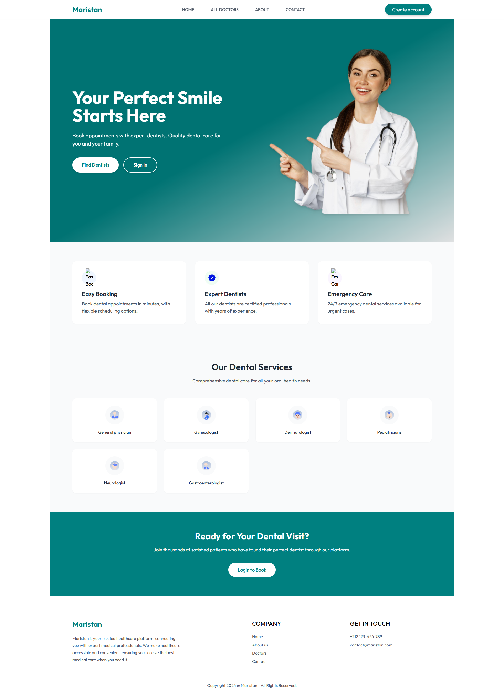
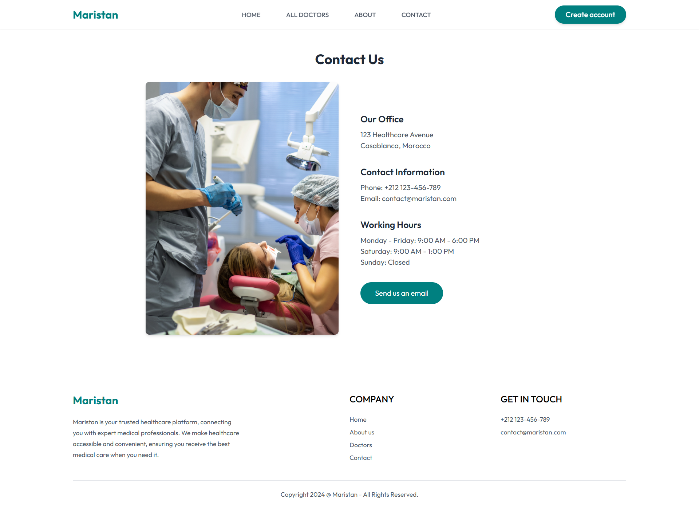
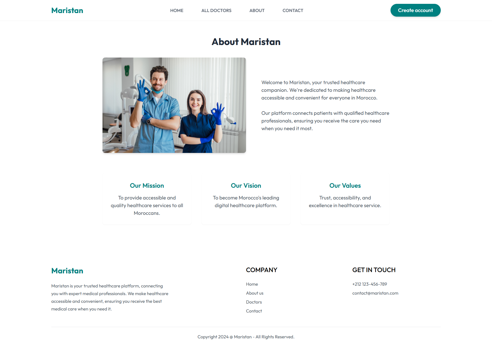
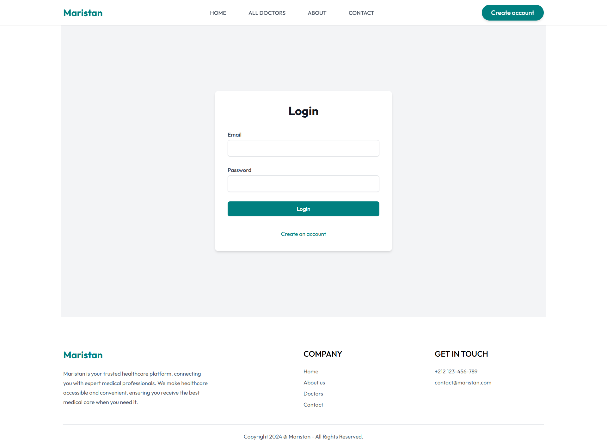
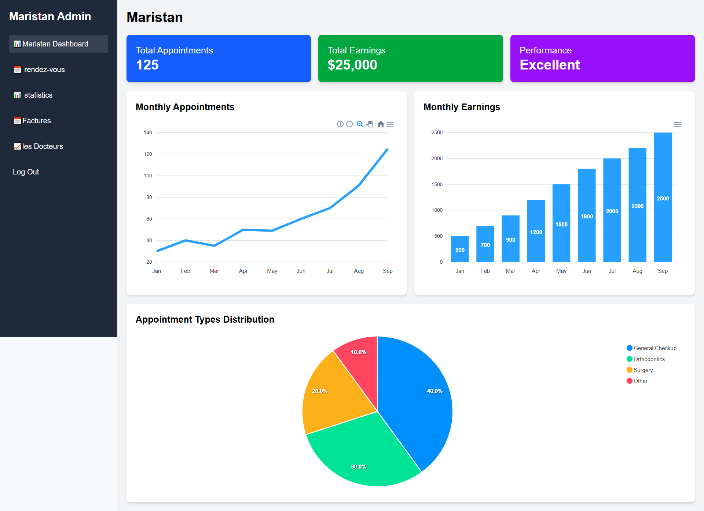

# 🦷 Dental Appointment Booking System

A full-stack **MERN** web application for managing dental appointments with role-based dashboards for **Admins**, **Doctors**, **Receptionists**, and **Patients**.  
Built with modern technologies and designed for **performance**, **analytics**, and **user experience**.

---

## ✨ Features

### 🔐 **Authentication & Authorization**
- Secure login/sign-up for Admin, Doctor, Receptionist, and Patient
- Role-based access control (**RBAC**)

### 📅 **Appointments Management**
- Patients can book appointments by selecting doctor, day, and time
- Receptionists can update appointment statuses:  
  ✅ Approved • 🔄 Ongoing • ✅ Finished • ❌ Refused • 🛑 Cancelled

### 📊 **Dashboard & Analytics**
Admin and Doctor dashboards with:
- Appointment statistics  
- Earnings  
- Performance metrics  

Visualized using **ApexCharts**

### 💳 **Stripe Payment Integration**
- Patients can pay securely for appointments via **Stripe**

### 🧑‍⚕️ **Doctor Features**
- Manage appointments & patients  
- View ratings & working hours

### 👨‍💼 **Receptionist Tools**
- Edit appointment statuses  
- Extract invoices

### 🧑‍🤝‍🧑 **Patient Features**
- Book and manage appointments

---

## 🌐 General Pages

- Home  
- About  
- Contact  
- Services  
- Case Studies  
- Articles

---

## 🛠️ Tech Stack

### **Frontend**
- React.js  
- Tailwind CSS  
- ApexCharts  
- React Router  
- Axios  

### **Backend**
- Express.js  
- Node.js  
- PostgreSQL with Prisma ORM  
- JWT for Authentication

### **Other Tools**
- Stripe API  
- Git & GitHub

---

## 🖼️ Screenshots

### 🏠 Home Page  


### 📬 Contact Us Page  


### ℹ️ About Us Page  


### 🔐 Login Page  


### 🛠️ Admin Dashboard  


---

## 🚀 Getting Started

### ✅ Prerequisites
- Node.js & npm  
- PostgreSQL  
- Git  

### 📦 Clone the Repo

```bash
git clone https://github.com/your-username/dental-appointments.git  
cd dental-appointments
